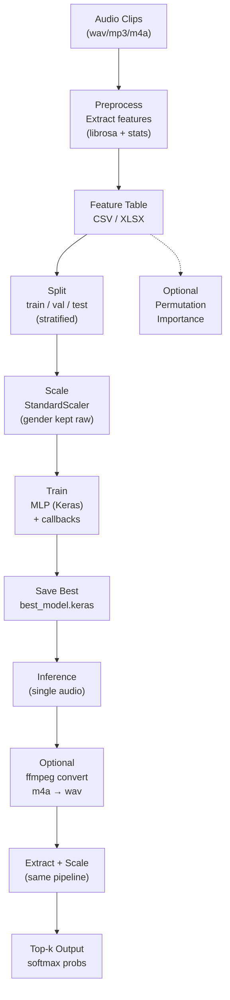
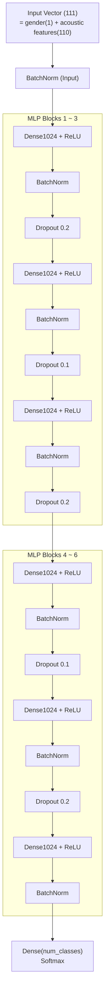

# 🎙️ voice-age-predict

Fundamental ML project: **hand-crafted audio features + MLP classifier** to predict **Age / Gender / (Gender+Age)** from speech.

- Dataset: Mozilla Common Voice (Kaggle mirror): https://www.kaggle.com/datasets/mozillaorg/common-voice  
- Approach: Feature Engineering (librosa) → Neural Network (Keras MLP)  
- Output: best checkpoint (`best_model.keras`) + top-k prediction for a single audio  

---

## 📌 What this project does
1) Build a **feature table** from raw audio clips  
2) Train an **MLP classifier** on the feature table  
3) Predict **top-k labels** for a given audio file (supports `.m4a` via ffmpeg conversion)

Code organization:
- `preprocess.py` : metadata filtering + feature extraction + CSV/XLSX builder  
- `train.py` : load/normalize → split → scale → train/eval (+ optional importance)  
- `model.py` : Keras MLP definition  
- `test.py` : single-audio inference (ffmpeg convert supported)  

---

## 🧱 Execution Pipeline (End-to-End)

### ✅ Pipeline Notes (그림 아래 설명)
- **Preprocess**: `librosa`로 오디오를 로드하고 스펙트럼/에너지/F0/MFCC 기반 **통계 특징(feature vector)** 을 뽑아 한 행으로 만든 뒤, CSV/XLSX의 **feature table**로 저장한다.  
- **Train**: feature table을 읽고 **라벨 기준 stratified split**을 먼저 수행한 뒤, train 기준으로만 `StandardScaler`를 fit한다. 이때 **gender(첫 컬럼)는 스케일링 후에도 원값 유지**하도록 다시 덮어쓴다.  
- **Inference**: 단일 오디오 입력도 동일한 특징을 뽑고, 학습 때 만든 스케일 규칙을 적용한 뒤 **softmax top-k 라벨/확률**을 출력한다. `.m4a` 등은 ffmpeg로 임시 wav 변환 후 처리한다.  
- **Importance(옵션)**: 컬럼을 하나씩 셔플해서 정확도 하락(Δacc)을 보는 **Permutation Importance**로 중요한 특징을 뽑는다.  

---

## 🧠 Model Architecture (MLP Classifier)

Input is a **111-D vector**:
- `gender_code` 1 dim (male=-1, female=+1, unknown=0)  
- `acoustic_features` 110 dims  

Example feature breakdown (110):
- Spectral 3: centroid / bandwidth / rolloff (mean)  
- MFCC 25 × (mean, std) = 50  
- Delta MFCC 25 × (mean, std) = 50  
- RMS 4: mean / std / skew / kurtosis  
- F0 3: mean / std / jitter  
→ 3 + 50 + 50 + 4 + 3 = 110  

### ✅ Model Notes (그림 아래 설명)
- 스펙트로그램 CNN/RNN 없이, **특징공학 + MLP**로 분류를 수행한다.  
- `Dense(1024) + BatchNorm + Dropout` 블록을 **총 6번** 쌓아 비선형 결합을 학습하고, 마지막에 `softmax(num_classes)`로 클래스 확률을 출력한다.  
- `num_classes`는 라벨 정의(`Gender_Age`, `Gender`, `Age`)에 따라 달라지며, 학습 데이터의 유니크 라벨 개수로 결정된다.  
